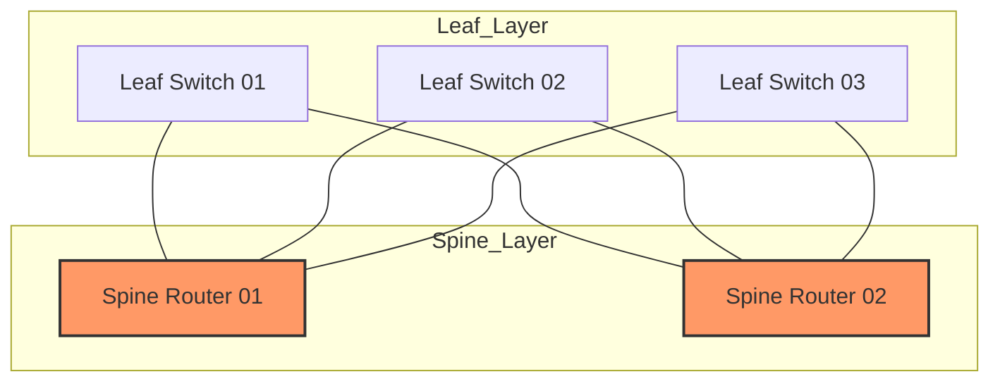

Markdown
# Network Automation Lab: Multi-Vendor Edge and Core Infrastructure

## Visão Geral do Projeto
Este repositório apresenta um laboratório de rede totalmente automatizado, simulando uma infraestrutura corporativa com roteamento dinâmico e monitoramento centralizado. O projeto demonstra a transição do gerenciamento via CLI (Command Line Interface) para o modelo de Infraestrutura como Código (IaC), utilizando ferramentas de automação para garantir escalabilidade, padronização e redução de erros operacionais.

### Objetivos Principais
* **Provisionamento Automatizado:** Configuração de interfaces, VLANs e endereçamento IP via Ansible.
* **Roteamento Dinâmico:** Implementação e convergência de protocolos OSPF e BGP em ambiente multi-vendor (Cisco, Arista e Linux).
* **Observabilidade:** Monitoramento de telemetria, tráfego e latência utilizando a stack Prometheus e Grafana.
* **Segurança e Hardening:** Implementação automatizada de Listas de Controle de Acesso (ACLs) e endurecimento de políticas de acesso SSH.

---

## Topologia da Rede
A infraestrutura utiliza uma arquitetura **Spine-Leaf (Clos Network)** de dois estágios, focada em redundância e balanceamento de carga via Camada 3 (L3).

### Diagrama da Infraestrutura (Mermaid)

Detalhes Técnicos:
Arquitetura: Spine-Leaf de dois níveis.

Encaminhamento: Roteamento L3 para eliminar o uso de Spanning Tree Protocol (STP).

Protocolo de Roteamento: Implementação de BGP (Border Gateway Protocol).

Redundância: Utilização de ECMP (Equal-Cost Multi-Pathing) para distribuição de tráfego.

Tecnologias e Ferramentas Utilizadas
Ambiente de Simulação: GNS3 / EVE-NG / Cisco Modeling Labs (CML).

Orquestração e Automação: Ansible (Playbooks e Roles).

Linguagem de Scripting: Python (Netmiko e Nornir).

Monitoramento: Docker (Prometheus e Grafana).

Protocolos: OSPF, BGP, SNMP e Syslog.

Instruções de Execução
1. Pré-requisitos
Bash
pip install ansible netmiko
2. Configuração do Inventário
Atualize o arquivo inventory.ini com os endereços IP dos ativos:

Ini, TOML
[core_routers]
R1_Cisco ansible_host=10.0.0.1
R2_Arista ansible_host=10.0.0.2
3. Aplicação das Configurações
Bash
ansible-playbook playbooks/site.yml
Estrutura do Repositório
Plaintext
```network-automation-lab/
├── ansible/
│   ├── group_vars/      # Variáveis de configuração por grupo
│   ├── inventory.ini    # Inventário de ativos da rede
│   └── playbooks/       # Automação de protocolos e ACLs
├── monitoring/
│   ├── prometheus.yml   # Configuração de métricas SNMP
│   └── docker-compose.yml # Orquestração Grafana/Prometheus
├── scripts/               # Scripts Python para auditoria e backup
├── assets/                # Diagramas e documentação visual
├── .gitignore             # Arquivos ignorados pelo Git
└── README.md              # Documentação principal
```
Identificação do Autor
Wilker Campos da Silva Braga| [LinkedIn (https://www.linkedin.com/in/wilker-braga-461ab4257/)| wilkerbhraga@gmail.com
